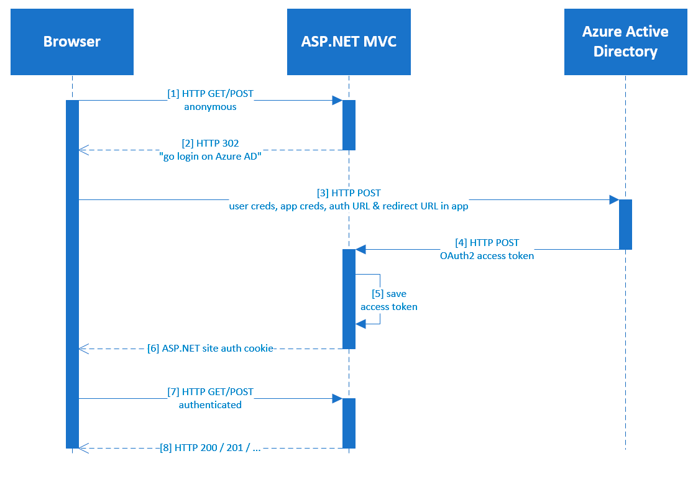

Using Azure Active Directory for App Authentication & Single Sign-On with Office 365
====================================================================================
>*Follow along at [github.com / andrewconnell / pres-azure-app-sso-o365](http://github.com/andrewconnell/pres-azure-app-sso-o365)*

Overview
========
1. [Office 365 & Microsoft Azure Overview](#office-365--microsoft-azure-overview)
2. [Identity: Office 365 & Azure AD](#identity-office-365--azure-ad)
3. [How Does it Work?](#how-does-it-work)

+-+-+-+-+-+-+-+-+-+-+-+-+-+-+-+-+-+-+-+-+-+-+-+-+-+-+-+-+-+-+-+-+-+-+-+-+-+-+-+-+

Office 365 & Microsoft Azure Overview
=====================================

Office 365
----------
  + Exchange Online
  + SharePoint Online
  + and more...
  + Great for business-y / enterprise-y / office-y solutions

Microsoft Azure
---------------
  + Host custom code
  + Leverage PaaS offerings for custom solutions
  + Leverage IaaS for legacy solutions

When Combined...
----------------
  + Tons of OOTB services
  + Can be used OOTB or integrated into custom solutions

Identity: Office 365 & Azure AD
===============================
- Office 365 uses an Azure AD directory under the covers to store users
- Azure AD directories can be sync'd with on-premises Active Directories
  + Azure Active Directory != Windows Active Directory
  + Azure AD supports app authentication (*currently in preview*)
- Custom apps can leverage Azure AD to authenticate users

Office 365 :heavy_plus_sign: Azure AD = Identity Bliss
------------------------------------------------------
- You can associate your Azure subscription with your Office 365 directory
- Enables apps to leverage Azure AD for authentication (user & app)
- Azure AD apps provide Office 365 access via app permissions (*regardless of user permissions*)
- Now custom apps can take advantage of powerful Office 365 services:
  + Metadata
  + Search
  + Workflow
  + Lists & libraries
  + Document management (checkin/checkout, declare record, versions, alerts, etc)

How Does it Work?
=================

Office 365 Trusts Azure AD
--------------------------
- Azure AD returns OAuth2 access token upon successful authentication
- Same access token can be used when accessing Office 365

What about that OAuth2 Access Token?
------------------------------------
- OAuth2 access tokens are like currency :moneybag:
  + Regardless of how it was obtained, anyone can use it
- Some protection built into the token (JWT)
  + Issued by...
  + Intended for...
  + Not valid before...
  + Expires in...

Protecting the Access Token :lock:
----------------------------------
- Never pass it over HTTP, **always** use HTTPS (SSL) 
- Never pass it to the client, keep it server-side
  + Once it touches the client, it's clear text & anyone can see it
- Create an intermediary that obtains, protects & uses the access token
  + Store in session state / cache / database
  + Use standard web auth with your app & intermediary
  + *Example: .NET's [Anti-Forgery](http://msdn.microsoft.com/en-us/library/system.web.helpers.antiforgery.aspx) Class*

How Does Authentication Work?
-----------------------------

Demo: Exploring the Authentication Flow
---------------------------------------

Using the Access Token
----------------------
- Once the ASP.NET intermediary site has the access token...
- Can include it in future HTTP requests to...
  + Office 365 / SharePoint Online REST API
  + Office 365 / SharePoint Online CSOM
  + Office 365 / Exchange Online REST API
  + Resources that trust Azure AD

Demo: Scenario - Project Research Tracker
-----------------------------------------

Thanks! Any Questions?
======================

Andrew Connell
==============
- [www.andrewconnell.com](http://www.andrewconnell.com) | [@andrewconnell](http://www.twitter.com/andrewconnell)
- this pres: [github.com / andrewconnell / pres-azure-app-sso-o365](http://github.com/andrewconnell/pres-azure-app-sso-o365)

>#Resources
- [MSDN P&P Web Dev - Project Silk: Client Web Development for Modern Browsers, Chapter 12: Security](http://msdn.microsoft.com/en-us/library/hh404095.aspx)
- [GitHub: Microsoft Azure Active Directory Samples and Documentation](https://github.com/AzureADSamples)
- [GitHub: AzureADSamples / WebApp-WebAPI-OAuth2-UserIdentity-DotNet](https://github.com/AzureADSamples/WebApp-WebAPI-OAuth2-UserIdentity-DotNet)
- [GitHub: OfficeDev / Research Project Code Sample](https://github.com/OfficeDev/Research-Project-Code-Sample)
  + Same scenario I built for the Microsoft Office 365 Developer team
  + [Channel9 video of me explaining the solution](http://channel9.msdn.com/Blogs/Office-365-Dev/Getting-started-with-the-Research-Project-Tracker-AngularJS-Office-365-API-Code-Sample)